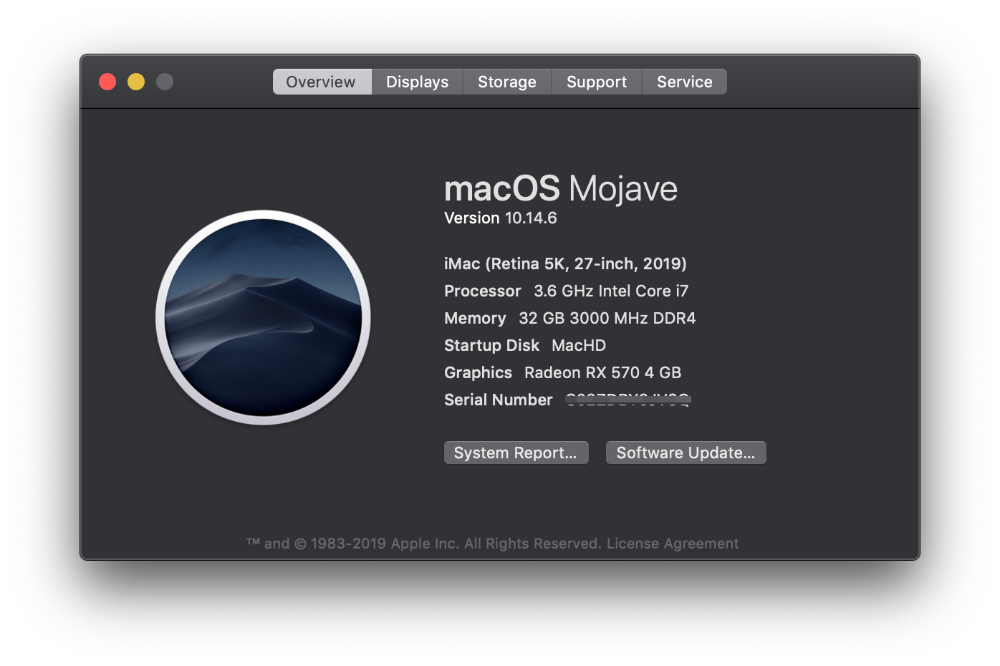

# Z370 AORUS ULTRA GAMING WIFI HACKINTOSH

## Components

| Component       | Price     | Manufacturer  | Model
| --------------- | -------   | ------------- | -----
| CPU             | $344.99   | Intel         | [Core i7-9700K](https://ark.intel.com/content/www/us/en/ark/products/186604/intel-core-i7-9700k-processor-12m-cache-up-to-4-90-ghz.html)
| CPU-Cooler      | $29.99    | Zalman        | [CNPS10X Optima](http://www.zalman.com/contents/products/view.html?no=344)
| Motherboard     | $129.99   | Gigabyte      | [Z370 AORUS ULTRA GAMING WIFI](https://www.gigabyte.com/Motherboard/Z370-AORUS-ULTRA-GAMING-WIFI-rev-10/)
| Memory          | $129.98   | GeIL          | [EVO SPEAR 32GB (4x8GB) DDR4 DRAM 3000MHz C16 (GSB416GB3000C16ADC)](https://www.newegg.com/geil-16gb-288-pin-ddr4-sdram/p/N82E16820158528)
| Storage         | $89.99    | Micron        | [960GB (1TB) 5100 ECO SATA III m.2](https://www.micron.com/products/solid-state-drives/product-lines/5100)
| Video-Card      | $149.99   | ASUS          | [EX-RX570-O4G](https://www.asus.com/Graphics-Cards/EX-RX570-O4G/)
| Case            | $158.02   | EVGA          | [DG-77 Alpine White](https://www.evga.com/products/product.aspx?pn=176-W1-3542-KR)
| PSU             | $54.99    | Seasonic      | [SSR-650GB3](https://seasonic.com/s12iii)
| Case-Fans       | $39.90    | Anidees       | [AI Tesseract 120mm 3pcs RGB](http://anidees.com/product/ai-tesseract-120/)
| WiFi/Bluetooth  | $13.99    | Broadcom      | [BCM94350ZAE](https://ru.aliexpress.com/item/32632959564.html)
|                 |           |               | 
| Total           | $1,141.83 |               | 

## EFI

### drivers/UEFI

| Driver               | Purpose
| -------------------- | ---
| ApfsDriverLoader.efi | Apple File System support
| AptioMemoryFix.efi   | Allows macOS to boot with UEFI

* When booting from a USB drive (e.g. for an installer), VBoxHfs.efi is required.

### kexts/Other

| Kext               | Purpose
| ------------------ | ---
| FakeSMC.kext       | SMC emulator
| Lilu.kext          | Kext/process patching
| WhateverGreen.kext | Patches for GPUs

* Audio: I use [USB speakers/headset](https://steelseries.com/gaming-headsets/arctis-5). I don't use the motherboard or front panel 3.5mm audio. If I did, I would need AppleALC.kext.
* Ethernet: I use WiFi for internet access. If I needed ethernet, I you need IntelMausiEthernet.kext.
* USB: All of my USB ports seem to work, my computer can sleep/wake/shutdown. If any of these were not the case, You would need USBInjectAll.kext and ACPI patches produced by usbmap.
